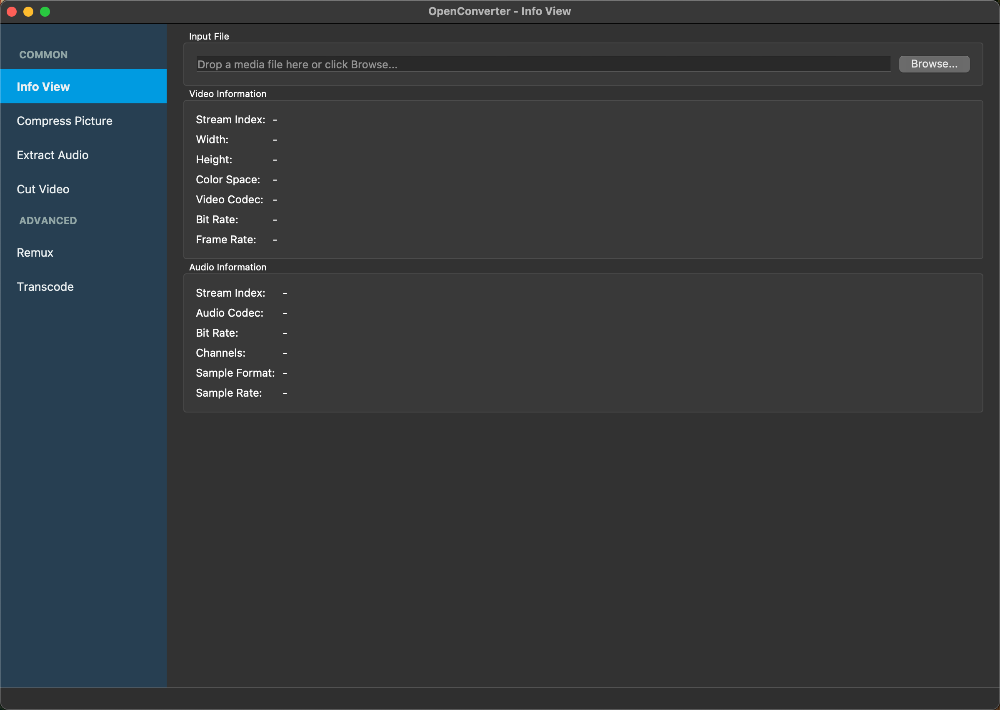
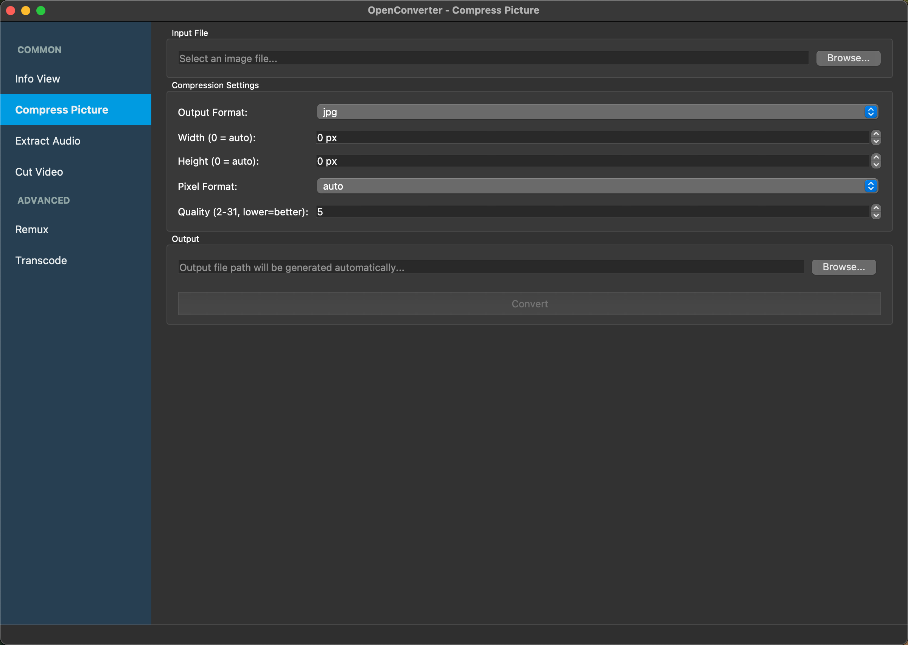

# OpenConverter

[](https://sonarcloud.io/summary/new_code?id=OpenConverterLab_OpenConverter)

## 📢  项目介绍

OpenConverter 是一个基于 **FFmpeg**源代码、**Qt**开源框架、**BMF框架**构建的软件，它提供了一些简单易用的工具，可以方便地转换、编辑和处理音视频文件。

这款转换器具有以下主要功能：

1. 支持更改视频编解码器以进行编码（例如libx264，libx265）
2. 支持无编码转换多媒体。
3. 支持显示多媒体文件中视频和音频流的信息。
4. 支持图片压缩，可调整格式和质量。
5. 支持从视频中提取音频。
6. 支持视频剪切，内置FFmpeg播放器，精确时间选择。
7. 支持平滑的进度跟踪和准确的剩余时间显示。
8. 运行时切换转码内核（FFmpeg、FFTool、BMF）
9. 提供图形界面和命令行界面（CLI）双重支持。

本项目使用[Qt框架](./doc/Qt.md)、FFmpeg库、[BMF框架](https://github.com/BabitMF/bmf)完成开发。

FFmpeg 开发教程可参考 [Learn FFmpeg the Hard Way](https://github.com/TSGU-OSC/Learn_FFmpeg_the_Hard_Way)

## 🌟  功能详解

运行 OpenConverter 后，您可以看到并使用以下功能：

<div align="center">






</div>

### 1. 支持更改音视频编解码器以进行编码（例如libx264，libx265，aac，ac3）

这款转换器允许用户轻松地更改音视频编解码器。例如，您可以选择使用libx264或libx265编码器，以获得更高的压缩率和更好的视频质量。

### 2. 支持无编码转换多媒体。

该转换器还支持无需编码即可转换多媒体文件。这意味着您可以在不改变原始视频和音频流的情况下，直接将文件从一种格式转换为另一种格式。这对于快速转换文件非常有用。

### 3. 支持显示多媒体文件中视频和音频流的信息

这款转换器可以显示有关视频和音频流的详细信息，包括分辨率、帧率、比特率等。这有助于您了解多媒体文件的属性，以便在转换过程中进行相应的调整。

### 4. 图片压缩

支持图片压缩，可自定义设置：
- 格式转换（JPEG、PNG、WebP、BMP）
- 分辨率调整
- 质量控制（1-31）

### 5. 音频提取

从视频中提取音频，支持编码器选择：
- 多种音频格式（MP3、AAC、AC3、FLAC、WAV）
- 比特率控制

### 6. 视频剪切

精确剪切视频片段：
- 内置FFmpeg视频播放器
- 实时播放和定位
- 精确的开始/结束时间选择
- 支持所有FFmpeg兼容格式

### 7. 高级进度跟踪和时间估算

在转换文件时，该播放器提供：
- 平滑的进度更新，具有UI友好的刷新率
- 使用持续时间平滑的准确剩余时间估算
- 实时进度百分比和持续时间跟踪
- 详细的控制台输出，用于监控转换状态

### 8. 运行时切换转码内核（FFmpeg、FFTool、BMF）

该软件提供三种不同的转码内核供选择：
- 基于FFmpeg API的内核，用于直接库集成
- FFTool内核，用于命令行工具集成
- 基于BMF框架的内核，用于高级处理
您还可以根据需求选择性编译这些内核。

### 9. 命令行界面（CLI）支持

非图形界面模式使用方法：
```bash
./OpenConverter [options] input_file output_file

Options:
  -t, --transcoder TYPE    Set transcoder type (FFMPEG, BMF, FFTOOL)
  -v, --video-codec CODEC  Set video codec
  -q, --qscale QSCALE      Set qscale for video codec
  -a, --audio-codec CODEC  Set audio codec
  -b:v, --bitrate:video BITRATE    Set bitrate for video codec
  -b:a, --bitrate:audio BITRATE    Set bitrate for audio codec
  -pix_fmt PIX_FMT         Set pixel format for video
  -scale SCALE(w)x(h)      Set scale for video (width x height)
  -h, --help               Show this help message
```

使用示例：
```bash
# 使用FFmpeg内核和H.264编码器转换视频
./OpenConverter -t FFMPEG -v libx264 input.mp4 output.mp4

# 使用BMF内核，H.265视频编码器和AAC音频编码器转换视频
./OpenConverter -t BMF -v libx265 -a aac input.mp4 output.mp4
```

## 使用指南
如果在运行过程遇到问题，欢迎查看我们的[使用指南文档](./doc/OpenConverter_Usage.md)

## 📖 贡献指南

如果你有兴趣贡献项目或发现了错误，请参考我们的 [贡献指南](./CONTRIBUTING.md)

## ☘️ 许可证

OpenConverter 是基于 Apache 2.0 许可证开源的。请在使用前阅读 [LICENSE](./LICENSE) 文件。
